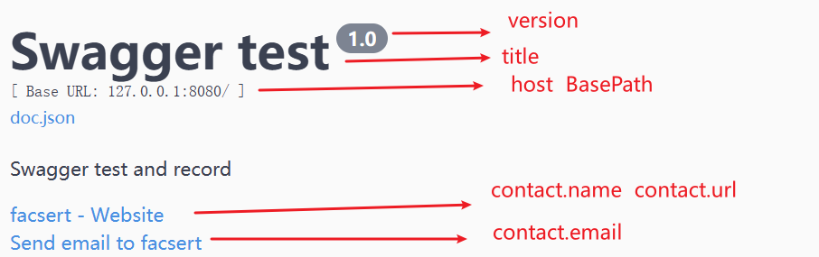
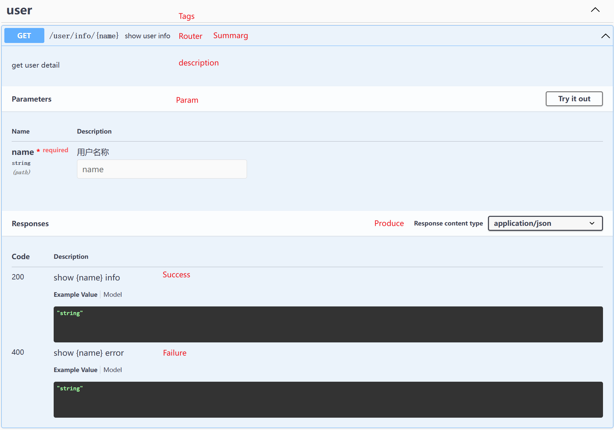

# Go Swagger

## 安装

下载 swagger 关联的库

```go
go get -u github.com/swaggo/swag/cmd/swag        // 命令行工具                          
go get -u github.com/swaggo/gin-swagger
go get -u github.com/swaggo/files
go get -u github.com/alecthomas/template

go install github.com/swaggo/swag/cmd/swag@latest
```

swag 在 `GOPATH/bin` 下

```bash
 $ swag -v
 > swag version v1.8.12
```

## 注解

go swagger 通过注释绑定接口设置和显示内容

### 通用 API 信息

```go
// @title           大标题
// @version         版本信息 
// @description     描述信息
// @host            接口服务的 IP 地址
// @BasePath        基本路径, 会添加到所有 API 路由前

// @contact.name    联系人信息
// @contact.url     联系人信息绑定的相关网址
// @contact.email   联系人 email

// @termsOfService  API 使用条款
// @license.name    Apache 2.0
// @license.url     http://www.apache.org/licenses/LICENSE-2.0.html
func main() {
    ...
}
```



### 单个 API

```go
// @tags     API 标签
// @id       API 的唯一标识
// @summary  API 的摘要
// @Produce  API 响应数据类型
// @Param    参数格式: 参数名, 参数位置, 数据类型, 是否必填, 注释
// @Success  响应成功: 状态码, 参数类型, 数据类型, 注释
// @Failure  响应失败: 状态码, 参数类型, 数据类型, 注释
// @Router   路由: 路由地址, HTTP 方法
```



`// @Produce 服务端返回给客户端的数据类型`

```go
// @Produce application/json          响应 json 类型数据          
// @Produce application/xml           响应 XML 格式数据
// @Produce text/plain                响应纯文本数据
// @Produce text/html                 响应 HTML 数据
// @Produce application/octet-stream  响应二进制流数据, 返回客户端需要下载的文件
```

`@Parma name locate type need description` API 参数信息和约束

- name: 参数名
- locate: 参数位置（path, query, header, body 或 formData）
- type: 参数的数据类型
- need: 是否必须
- description: 参数的描述

```go
// @Param userId path int true "UserID"         路径参数 /user/:userId
// @Param username query string true "Username" 参数存在请求尾部 /user?username=petter
// @Param user body User true "User"            参数存在请求体中, POST 请求
// @Param file formData file true "File upload" 表单数据, 用于文件上传 
```